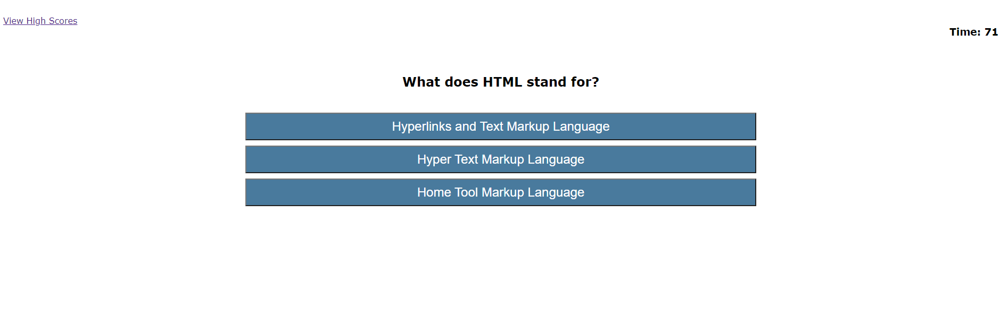

# Code Quiz

## Description
This is a timed HTML/JavaScript coding quiz with multiple-choice questions. This app runs in the browser and features
dynamically updated HTML and CSS powered by JavaScript code.

## Mock-Up

The following image shows the web application's appearance and functionality:

## Built With
* HTML
* CSS
* JavaScript

## User Story
AS A coder
I WANT to take a timed quiz on JavaScript fundamentals that stores high scores
SO THAT I can gauge my progress compared to my peers

## Acceptance Criteria
GIVEN I am taking a code quiz
- WHEN I click the start button
THEN a timer starts and I am presented with a question
- WHEN I answer a question
THEN I am presented with another question
- WHEN I answer a question incorrectly
THEN time is subtracted from the clock
- WHEN all questions are answered or the timer reaches 0
THEN the game is over
- WHEN the game is over
THEN I can save my initials and score

## Website
https://chuckrfields.github.io/codequiz/

## Contribution
Made with ❤️ by Chuck Fields

### ©️2021
